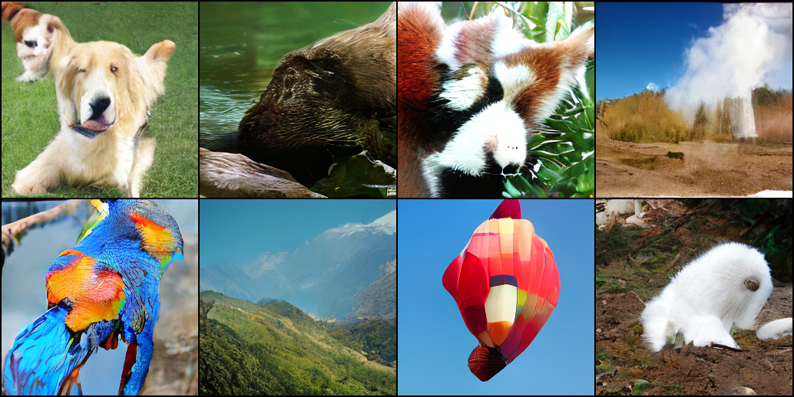
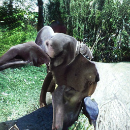
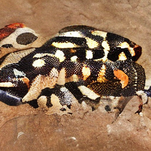

# DiNext
ConvNext Based Diffusion - A very rough experiment into creating diffusion models using ConvNext. This repo is a fork from [facebookresearch/DiT](https://github.com/facebookresearch/DiT).

Related works:
- [1] [Single input guided generation](https://proceedings.mlr.press/v202/nikankin23a/nikankin23a.pdf)
- [2] [ConvNext based UNet](https://medium.com/@mickael.boillaud/denoising-diffusion-model-from-scratch-using-pytorch-658805d293b4)
- [3] [DiT](https://arxiv.org/pdf/2212.09748)

The related works (especially [1]) shows how ConvNext is very powerful contendor for stable diffusion. DiNext combines this knowledge with the current state of the art, DiT, in an attempt to maximise performance. 

# Some preliminary samples

From left to right, top to bottom - golden retriever, otter, red panda, geyser, macaw, valley, balloon, arctic fox.

# Preliminary results

All results are against "DiT-XL/2". The code is a bit messy, but both DiT and DiNext are equivelent in memory useage, however DiNext has half the parameter count (fix already made!).

## Inference time - 256x256

Computed on a 3090, single sample.

| DiT    | DiNext |
| -------- | ------- |
| 20.28 seconds | 11.67 seconds |

## Metrics

While the speeds are great, the actual evaluation metrics are... not good - Which is to expected given the very (and I mean very) small amount of training performed.

Please note that the DiNext metrics were calulated using 500 samples, rather than the academic 50,000 - Should still provide *some* insight.

| Metric | DiT    | DiNext |
| -------- | -------- | ------- |
| Inception (higher is better) | 278.24 | 61.03 |
| FID (lower is better) | 2.27 | 90.90 |

## Summary
Overall a working proof of concept, but a very long distance away from a useable solution. Current plan is some architextual improvements, then a loooong training run.

## Random Samples

